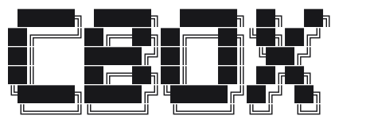

A CLI that runs [Claude Code](https://claude.com/claude-code) inside an [`sbx`](https://docs.docker.com/ai/sandboxes/) sandbox, one sandbox per project directory, built around a small hook contract (`cbox.config.ts`) that lets you fully customize what goes into that sandbox — its env vars, mounts, `settings.json`, and network allowlist — plus run your own setup before and after it's created. Run `cbox` in a repo and it creates a sandbox mounting that directory (letting `sbx` pick the sandbox's own name), or reuses the one already mounting it as its primary workspace — so running `cbox` again in the same place drops you back into the same sandbox instead of spinning up a new one.

### Requirements

- Node.js
- [`tsx`](https://github.com/privatenumber/tsx) installed globally (`npm install -g tsx`) — cbox has no other runtime dependency
- [`sbx`](https://docs.docker.com/ai/sandboxes/) on `PATH`

### Quickstart

1. **Add to PATH.** Add this repo's directory to `PATH`, so the `cbox` command resolves from anywhere:

   ```sh
   echo 'export PATH="$HOME/repos/cbox:$PATH"' >> ~/.zshrc
   ```

2. **Add a config.** Create `cbox.config.ts` in this repo's root with a single hook to start — this one lets every sandbox reach npm's registry:

   ```ts
   import { defineConfig, type ResolveAllowedHostsHook } from "cbox";

   const resolveAllowedHosts: ResolveAllowedHostsHook = () => {
     return ["registry.npmjs.org"];
   };

   export default defineConfig({ resolveAllowedHosts });
   ```

   See [Hooks](#hooks) for the full contract, and [`cbox.config.example.ts`](./cbox.config.example.ts) for a larger worked example.

   Alternatively, set `CBOX_CONFIG` to point at a config file anywhere on disk, and run `npm link <path-to-this-repo>` once from that location (so `import { defineConfig } from "cbox"` has somewhere to resolve from).

3. **Run it in a project.**

   ```sh
   cd ~/repos/some-project
   cbox
   ```

   This mounts `some-project` into a sandbox, allowing the hosts from step 2 and syncing Claude's session history back to `~/.claude/projects` after every message. Your Claude settings and skills are copied in, then `claude --dangerously-skip-permissions` runs inside it. Any arguments are forwarded to that session, e.g. `cbox --resume abc123`.

### Key Features

- **Hook-based config.** `cbox.config.ts` can fully replace the env vars, mounts, settings.json, and allowed network hosts a fresh sandbox gets, plus run arbitrary setup before/after creation — see [Hooks](#hooks).
- **Skills always synced.** Everything under `~/.claude/skills/` is copied into the sandbox on every run, not just on creation.
- **Session history survives the sandbox.** Every transcript Claude writes inside the sandbox is mirrored back to `~/.claude/projects` on the host after every message.
- **Allowed hosts and settings can be refreshed without recreating the sandbox.** `cbox refresh` re-applies `resolveAllowedHosts` and `resolveSettings` to the sandbox already mounting the current directory (or every cbox-managed sandbox with `--all`) — see [Commands](#commands).

### Commands

| Command | Description |
|---|---|
| `cbox` | Create (or reuse) the sandbox for this directory and run `claude --dangerously-skip-permissions` inside it. |
| `cbox refresh` | Re-run `resolveAllowedHosts` and `resolveSettings` against the sandbox already mounting this directory, and re-copy skills — without recreating the sandbox or starting a session. Fails if no such sandbox exists yet. `resolveEnv` and `resolveMounts` aren't covered: both are fixed into the sandbox at creation and can't be changed without recreating it. |
| `cbox refresh --all` | Same as `cbox refresh`, but swept across every cbox-managed sandbox still running, regardless of which directory you run it from. A sandbox cbox created or reused before now knows about but that's since disappeared (e.g. removed with `sbx rm`) is warned about and skipped, not silently dropped — it stays registered in case it comes back. One sandbox failing doesn't stop the rest, but makes the command exit non-zero. |

`cbox refresh --all` sweeps a small local registry at `~/.cbox/sandboxes.json`, mapping each directory to the sandbox `cbox` made for it — kept because `sbx ls`'s `agent` field alone only says a sandbox runs the claude image, not that cbox made it.

### Configuration

| Variable | Description |
|---|---|
| `CBOX_CONFIG` | Path to `cbox.config.ts`. Unset means "use cbox's own install root" — if `cbox.config.ts` doesn't exist there either, cbox runs with no hooks at all, just its own fixed behavior. An explicitly-set path that doesn't exist is a real misconfiguration and cbox exits with an error. |

### Hooks

All six hooks are optional. `resolveEnv`/`resolveMounts` only ever run on the sandbox-**creation** path — reusing an existing sandbox skips straight to the skills copy and `sbx run`, and there's no way to change either without recreating the sandbox. `resolveSettings`/`resolveAllowedHosts` also run on creation, but can be re-applied to an already-existing sandbox with `cbox refresh` (see [Commands](#commands)) without recreating it. `resolveEnv`/`resolveMounts`/`resolveSettings`/`resolveAllowedHosts` are all **full-replace**: whatever they return is final. Core's own fixed values — the primary workspace mount, and the mount/env var/`Stop` hook that sync session history (see below) — are never routed through a hook, so build on anything else you want, like the host's own `~/.claude/settings.json`, by reading it yourself. `preCreate`/`postCreate` are **additive**: cbox's own fixed setup always runs regardless of what they do.

Every hook's `ctx` is `{ workdir, homedir }`; `postCreate`'s `ctx` additionally carries `sbx`, a helper with `cp(localPath, remotePath, opts?)` and `exec(args)`, so a hook never shells out to `sbx` by hand.

- **resolveEnv**`(ctx) → Record<string, string>`
  Env vars passed to `sbx create -e KEY=VALUE`. Core always adds `HOST_HOME` on top of this, overriding any value returned here — the session-history sync below depends on it.

- **resolveMounts**`(ctx) → string[]`
  Extra paths bind-mounted into the sandbox, beyond its primary workspace and `~/.claude/projects`. cbox itself always mounts both — neither is ever passed through this hook, so there's no way for a hook to affect them.

- **resolveSettings**`(ctx) → Record<string, unknown>`
  Written as JSON to the sandbox's `~/.claude/settings.json`, after cbox appends its own `Stop` hook entry that syncs session history back to the host. Read the host's own `~/.claude/settings.json` yourself if you want to extend it rather than replace it outright.

- **resolveAllowedHosts**`(ctx) → string[]`
  Hosts allowed via `sbx policy allow network --sandbox <name>`, scoped to the new sandbox. Runs right after creation, before `postCreate`, so a `postCreate` step can rely on them already being reachable.

- **preCreate**`(ctx) → void | Promise<void>`
  Runs before the sandbox exists — there's nothing to bind an `sbx` helper to yet, since `sbx` itself hasn't picked a name.

- **postCreate**`(ctx & { sbx }) → void | Promise<void>`
  Runs once the sandbox exists, before cbox writes `resolveSettings`'s result.

## License

[MIT](./LICENSE)
